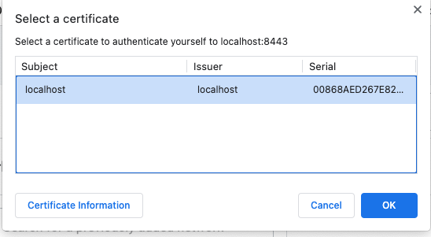

#  Chrome Browser Runbook for HTTP based mTLS with EthRPC

# Overview

HTTP-based mTLS is a secure protocol that combines HTTPS with mutual authentication of both client and server. This provides an extra layer of security to protect against eavesdropping and tampering of data in transit. Both Chrome and Firefox support HTTP-based mTLS, but the steps to set it up and use it may differ.

## Pre-Requisite

- VMware Blockchain for Ethereum has been deployed
- Suggested Stack:
  - Chrome Browser
  - MAC Operating System
  - Metamask Wallet

Chrome uses OS level certificates to communicate with EthRPC through HTTP based mTLS.

To add root certificate and client certificate, follow these steps:

1. On your computer open the Keychain Access application.
2. Navigate to the "Login" section and select "Certificates".
<br> 

3. Drag and drop the certificate authority file into Keychain Access.
4. Generate a `p12` file as mentioned in the section [Generating p12 file](#generating-p12-file). Drag and drop the generated `p12` file into the keychain (Ensure that your client certificate has a dropdown which shows the corresponding client private key)
5. Double click on the certificates (Client Certificate and Certificate Authority), if you get the following warning "This root certificate isn't trusted" under the trust sub-section set ***When using this certificate*** to ***Always Trust***. Confirm the changes by entering your computer password.
<br> 
6. If your Chrome browser is running, please quit it and restart the browser application again.
5. Open Chrome go to Metamask. Click Expand View then open Settings go to Networks and then click the VMBC URL you are trying to connect to. Chrome will pop up a list of certificates that can be used.
6. Click the certificate you have added and then click okay.
<br> 

7. Change the Metamask network to the VMBC URL, and you should have a successful connection.

### Troubleshooting Guide
- If you face problems related to CORS or some valid scenarios start failing to work during set up, we suggest to reset your chrome browser
   
### Generating p12 file

In order to import a client certificate via Firefox certificate manager you need to use a p12 file. To generate a `p12` file you need to have a client certificate, client key and the CA certificate. 

<br>The following command allows you to generate a p12 file:

```sh
openssl pkcs12 -export -out client.p12 -inkey <client.key> -in <client.crt> -certfile <ca.crt>
```
